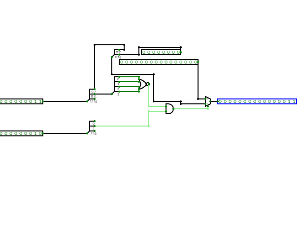

# ArquitecturaComputadoras
Repo para los trabajos del coba

# Diseño e Implementación de la Instrucción `BR =` (Branch on Flags)

Este repositorio documenta el diseño lógico y la implementación de la instrucción `BR =` para un microprocesador de 16 bits.

## Descripción de la Instrucción

La instrucción `BR =` evalúa el estado del procesador para determinar si debe realizar un salto en el flujo de ejecución del programa. A diferencia de las instrucciones que comparan registros explícitamente (como `BEQ`), `BR` consulta las banderas de estado generadas por operaciones previas.

* **Codop:** `1100`
* **Condición de Igualdad (`=`):** `0000`
* **Mecanismo de Salto:** La instrucción verifica la bandera **Z** ubicada en el bit 1 del registro **PSW**. Si la bandera Z está activa (1), el procesador suma el `Offset` proporcionado en la instrucción al Contador de Programa.
## Herramientas y Especificaciones Técnicas

* **Simulador:** [CircuitVerse](https://circuitverse.org/users/417166/projects/branch-on-flags-valentino-aviani/)
* **Arquitectura:** 16 bits
* **Registro de Estado:** PSW

## Arquitectura Lógica del Circuito

El circuito se estructuró en cuatro etapas funcionales principales:

1.  **Decodificación (Splitters):** Se utilizaron divisores (splitters) para aislar los campos relevantes. Se extrajo el Offset (bits 0-7) y la Condición (bits 8-11) de la instrucción, y se aisló el flag Z (bit 1) del bus del PSW.
2.  **Evaluación de la Condición:** Se implementó una compuerta **NOR** de 4 entradas para detectar el código específico de la condición `0000`.
3.  **Decisión Lógica:** Una compuerta **AND** combina la señal de validación de la condición con el estado de la bandera Z del PSW.
4.  **Control de Flujo:** El offset de 8 bits se extendió a 16 bits mediante un extensor de ceros. Finalmente, un **Multiplexor** de 16 bits, gobernado por la compuerta AND, direcciona el offset extendido hacia la salida si la condición se cumple, o emite un vector nulo en caso contrario.

## Esquema de la instrucción

A continuación, se presenta la implementación de la instrucción en CircuitVerse:

**Desarrollador:** Valentino Aviani  
**Curso:** 6to Informática  
**Asignatura:** Arquitectura de Computadoras  
**Institución:** Instituto Politécnico  
**Año:** 2026
